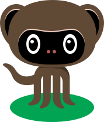

<p align="center">
  <a href="https://list.community/">
    
  </a>
</p>

<p align="center">
  List.community is an easy way to browse curated lists on GitHub.
</p>

---

### Found a bug or have feedback?

Please open an [issue here](https://github.com/listcommunity/support).
Feel free to submit pull requests too.

### How do I add a list?

Please add your list [to this file](https://github.com/listcommunity/support/blob/master/src/lists.js)
and submit a pull request. Please follow this format and indentation:

```js
"sorrycc/awesome-javascript": { // The GitHub user and repo names
  "slug": "javascript", // A slug used for short URLs (like https://list.community/javascript)
  "label": "JavaScript", // The label displayed in the homepage and in the page title
  "shortDescription": // Description shown in the homepage
    "JavaScript is an object-oriented programming language used alongside HTML and CSS to give functionality to web pages.",
  "logo": "https://avatars.githubusercontent.com/tc39", // The logo, ideally a GitHub avatar so that we can pass a `size` param
  "color": "#f7df1e", // Color used in the topbar
  "category": "Programming Languages", // Ideally, one of the categories from https://github.com/sindresorhus/awesome
  "invertTextColor": true, // If necessary for better readability, true will make the text in the topbar black instead of white
}
```

### Contributors

This project is only possible thanks to all the people who maintain these lists and contribute to them.
